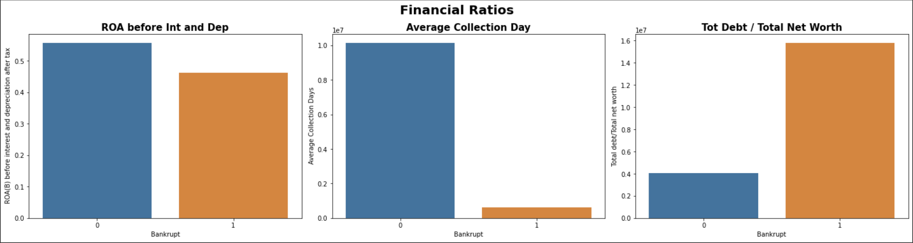

# Project-2
Coding Dojo Project

Company Bankruptcy Prediction (Study Case : Taiwan)

Project Purpose
The purpose of this project is to create a model that can be used to predict whether a company will go bankrupt or not based on their finantial ratio.

Description
Source of Data : https://www.kaggle.com/datasets/fedesoriano/company-bankruptcy-prediction

The model used in this project is Random Forest Classifier with Hyperparameter Tuning using GridSearchCV.
The Hyperparameter that is tuned are the sample leaf, sample split, max depth and n estimators.

After tuning the Hyperparameter we applied PCA process to increase the performance of the model.

The Accuracy score for this model is 97%

Finding:

The company that is predicted to go bankruptcy has a good performance to collect cash but can not handle their expense.

Recommendations:
For further research it is good to know each company industry and how the economy condition at that time. 
